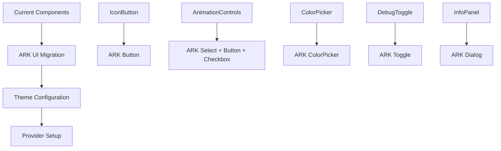
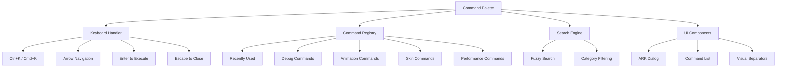
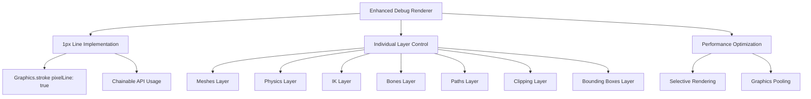
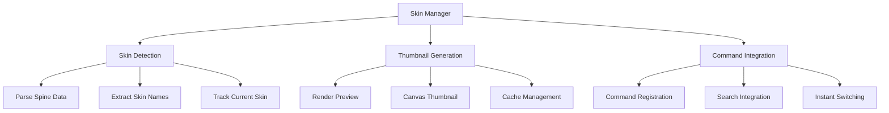
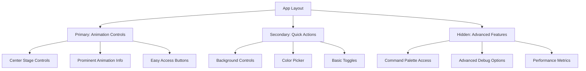

# Spine Benchmark UI Modernization Plan

## Overview
This document outlines the comprehensive plan to modernize the Spine Benchmark application with ARK UI components, a VS Code-style command palette, enhanced debug capabilities, and an animation-centric user experience.

## Current State Analysis
- **Framework**: React 19 + TypeScript + Pixi.js 8.11
- **Spine Version**: 4.2.74 (@esotericsoftware/spine-pixi-v8)
- **Current UI**: Custom components with basic styling
- **Debug System**: Existing debug renderer with toggle controls
- **Architecture**: Hook-based state management with custom containers

## Goals
1. Replace current UI with ARK UI components
2. Implement VS Code-style command palette (Ctrl+K/Cmd+K)
3. Create animation-player-centric interface
4. Add individual debug layer toggles
5. Implement spine skin selection with thumbnails
6. Update debug renderer to use 1px lines with pixelLine
7. Add version display in corner

---

## Phase 1: ARK UI Integration

### 1.1 Dependencies Installation
```json
{
  "@ark-ui/react": "^3.x.x",
  "fuse.js": "^7.x.x",
  "react-hotkeys-hook": "^4.x.x"
}
```

### 1.2 Component Migration Strategy



### 1.3 Files to Update
- [`src/components/IconButton.tsx`](src/components/IconButton.tsx) → ARK Button
- [`src/components/AnimationControls.tsx`](src/components/AnimationControls.tsx) → ARK Select/Button/Checkbox
- [`src/components/ColorPicker.tsx`](src/components/ColorPicker.tsx) → ARK ColorPicker
- [`src/components/DebugToggle.tsx`](src/components/DebugToggle.tsx) → ARK Toggle
- [`src/components/InfoPanel.tsx`](src/components/InfoPanel.tsx) → ARK Dialog
- [`src/App.tsx`](src/App.tsx) → Add ARK Provider

---

## Phase 2: VS Code-Style Command Palette

### 2.1 Command Palette Architecture



### 2.2 Command Categories

#### Recently Used
- Last 5-10 executed commands
- Persistent across sessions (localStorage)

#### Debug Commands
- `Debug: Toggle Meshes` - Show/hide mesh triangles and hulls
- `Debug: Toggle Physics` - Show/hide physics constraints
- `Debug: Toggle IK Constraints` - Show/hide IK visualization
- `Debug: Toggle Bones` - Show/hide bone structure
- `Debug: Toggle Paths` - Show/hide path constraints
- `Debug: Toggle Clipping` - Show/hide clipping regions
- `Debug: Toggle Bounding Boxes` - Show/hide bounding boxes
- `Debug: Clear All` - Turn off all debug layers

#### Animation Commands
- `Animation: Play/Pause` - Toggle animation playback
- `Animation: Stop` - Stop current animation
- `Animation: Restart` - Restart current animation
- `Animation: Next` - Switch to next animation
- `Animation: Previous` - Switch to previous animation
- `Animation: Toggle Loop` - Toggle loop mode
- `Animation: Set Speed` - Adjust playback speed

#### Skin Commands
- `Skin: [Skin Name]` - Switch to specific skin (dynamic list)
- `Skin: Default` - Switch to default skin
- `Skin: Refresh List` - Reload available skins

#### Performance Commands
- `Performance: Show Benchmark` - Toggle benchmark info panel
- `Performance: Show Timeline` - Toggle event timeline
- `Performance: Export Data` - Export performance data

### 2.3 New Files to Create
- `src/components/CommandPalette.tsx` - Main command palette component
- `src/hooks/useCommandPalette.ts` - Command palette state management
- `src/utils/commandRegistry.ts` - Command registration and execution
- `src/utils/recentCommands.ts` - Recent commands persistence

---

## Phase 3: Enhanced Debug System

### 3.1 Debug Renderer Updates



### 3.2 Graphics API Updates
Update [`src/core/CameraContainer.ts`](src/core/CameraContainer.ts):

```typescript
// Old approach
graphics.lineStyle(2, 0xFF00FF, 1);

// New approach with pixelLine
graphics.stroke({ 
  color: 0xFF00FF, 
  width: 1, 
  pixelLine: true 
}).moveTo(x1, y1).lineTo(x2, y2);
```

### 3.3 Individual Debug Layers
Each debug layer becomes independently controllable:
- Separate state management for each layer
- Individual command palette commands
- Granular performance control

---

## Phase 4: Skin Selection System

### 4.1 Skin Management Architecture



### 4.2 Implementation Details
- Detect skins from `spineInstance.skeleton.data.skins`
- Generate 64x64 thumbnail previews
- Cache thumbnails for performance
- Integrate with command palette search

### 4.3 New Files
- `src/hooks/useSkinManager.ts` - Skin state management
- `src/utils/skinUtils.ts` - Skin detection and thumbnail generation
- `src/components/SkinPreview.tsx` - Thumbnail component

---

## Phase 5: Animation-Centric UI Design

### 5.1 Layout Restructuring



### 5.2 Design Principles
- Animation controls take center stage
- Debug features accessible but not prominent
- Command palette for power users
- Clean, minimal interface by default

---

## Phase 6: Version Display

### 6.1 Corner Version Overlay
- Position: Bottom-right corner
- Opacity: 60%
- Content: App version + Spine version
- Non-intrusive design

### 6.2 Implementation
```typescript
// Version info from package.json and spine library
const versionInfo = {
  app: "1.0.0",
  spine: "4.2.74"
};
```

---

## Phase 7: File Structure Changes

### 7.1 New Directory Structure
```
src/
├── components/
│   ├── CommandPalette.tsx (new)
│   ├── VersionDisplay.tsx (new)
│   ├── SkinPreview.tsx (new)
│   ├── IconButton.tsx (updated - ARK UI)
│   ├── AnimationControls.tsx (updated - ARK UI)
│   ├── ColorPicker.tsx (updated - ARK UI)
│   ├── DebugToggle.tsx (updated - ARK UI)
│   └── InfoPanel.tsx (updated - ARK UI)
├── hooks/
│   ├── useCommandPalette.ts (new)
│   ├── useSkinManager.ts (new)
│   ├── useSpineApp.ts (updated)
│   └── useKeyboardShortcuts.ts (new)
├── utils/
│   ├── commandRegistry.ts (new)
│   ├── recentCommands.ts (new)
│   ├── skinUtils.ts (new)
│   └── keyboardUtils.ts (new)
├── core/
│   ├── CameraContainer.ts (updated - 1px lines)
│   └── [existing files]
```

---

## Implementation Priority

### Phase 1: Foundation (Week 1)
1. Install ARK UI dependencies
2. Set up ARK UI provider and theme
3. Migrate basic components (IconButton, DebugToggle)

### Phase 2: Command Palette (Week 2)
1. Create command registry system
2. Implement VS Code-style command palette
3. Add keyboard shortcuts handling
4. Integrate basic commands

### Phase 3: Debug Enhancement (Week 3)
1. Update debug renderer with pixelLine
2. Implement individual debug layer toggles
3. Add debug commands to palette
4. Optimize performance

### Phase 4: Advanced Features (Week 4)
1. Implement skin selection system
2. Add animation-centric UI improvements
3. Create version display
4. Polish and testing

---

## Technical Considerations

### Performance
- Lazy load skin thumbnails
- Debounce command palette search
- Optimize debug renderer updates
- Cache command search results

### Accessibility
- Keyboard navigation for command palette
- Screen reader support for ARK UI components
- High contrast mode compatibility
- Focus management

### Browser Compatibility
- Modern browsers with ES2020+ support
- WebGL support for Pixi.js
- Keyboard event handling across platforms

---

## Success Metrics

1. **User Experience**: Faster access to debug features via command palette
2. **Performance**: No regression in animation playback performance
3. **Visual Quality**: Crisp 1px debug lines with pixelLine
4. **Functionality**: All current features preserved and enhanced
5. **Maintainability**: Cleaner component architecture with ARK UI

---

## Risk Mitigation

### ARK UI Migration Risks
- **Risk**: Breaking existing functionality
- **Mitigation**: Gradual migration, component-by-component testing

### Command Palette Complexity
- **Risk**: Performance impact from search functionality
- **Mitigation**: Debounced search, virtual scrolling for large lists

### Debug Renderer Changes
- **Risk**: Visual regression in debug output
- **Mitigation**: Side-by-side comparison testing, fallback options

This plan provides a comprehensive roadmap for modernizing the Spine Benchmark application while maintaining its core functionality and performance characteristics.