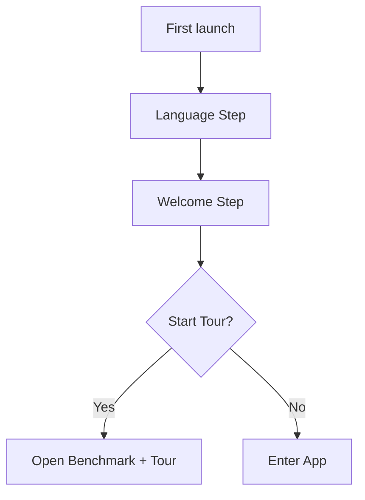
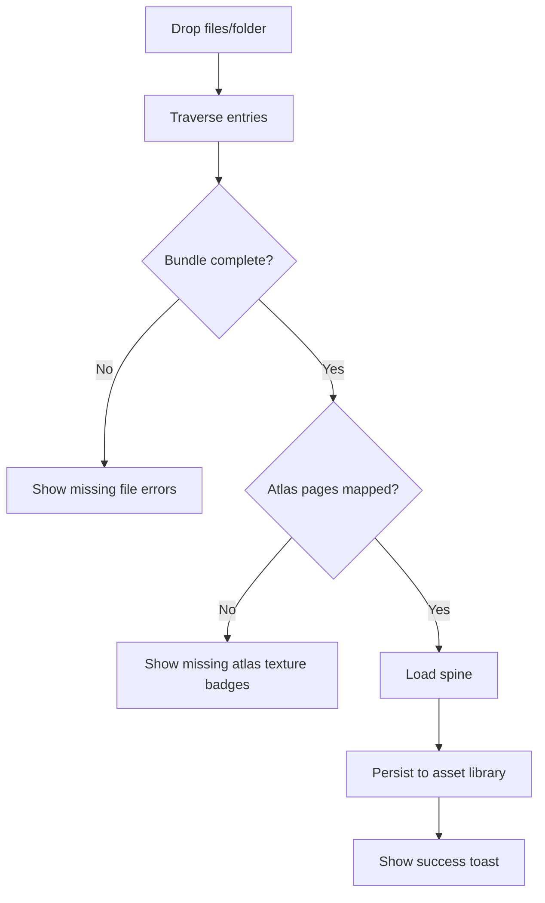
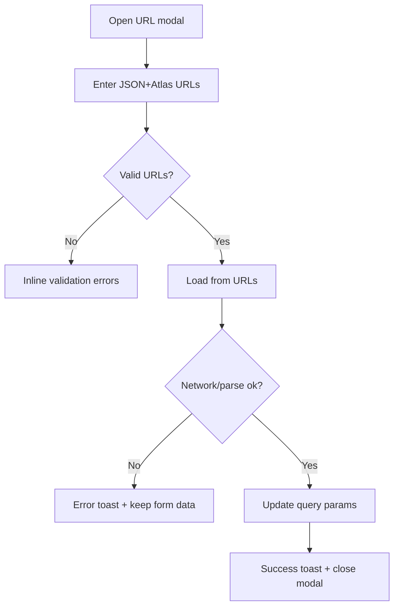
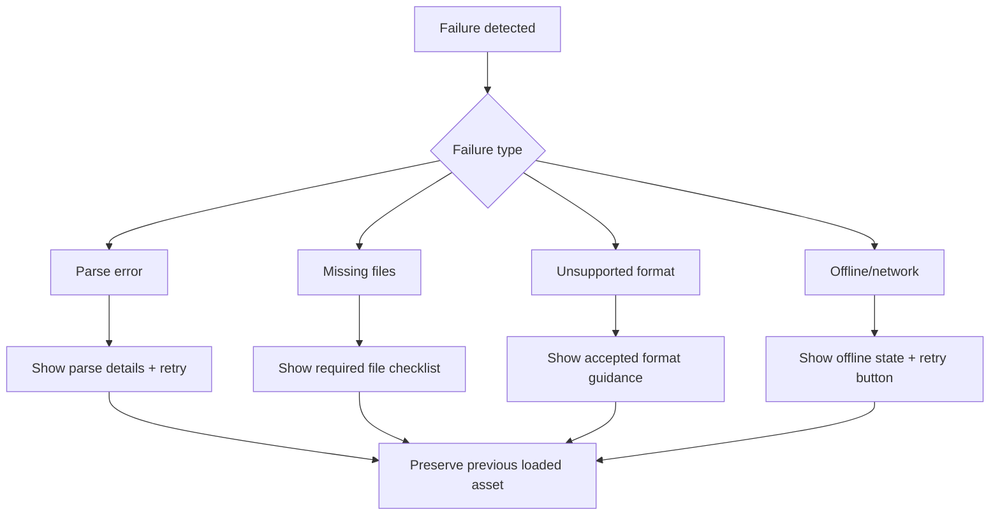

# Spine Benchmark Redesign Specification

## 0. Scope, Constraints, and Parity Contract

**Project:** Spine Benchmark (single-page web app)  
**Spec type:** Production-ready redesign + UX systems handoff  
**Style guide base:** `mobile-2-editorialdatadriven` (adapted for welcoming animator-first UX)

### 0.1 Non-negotiable parity commitments
1. No existing capability is removed.
2. All existing routes and route intents are preserved exactly:
   - `/` -> redirect `/tools/benchmark`
   - `/tools` -> redirect `/tools/benchmark`
   - `/tools/benchmark`
   - `/tools/mesh-optimizer`
   - `/tools/physics-baker`
   - `/tools/draw-call-inspector`
   - `/tools/atlas-repack`
   - `/tools/comparison`
   - `/tools/animation-heatmap`
   - `/assets`
   - `/documentation`
   - `/partners`
3. Persisted local asset workflow remains intact (IndexedDB-backed library + load/delete).
4. Route-to-route continuity remains: currently loaded Spine data stays usable while switching tools.
5. URL import (`json` + `atlas`) remains available and query params stay supported.

### 0.2 Primary audience and tone
- **Primary:** Animators and technical artists.
- **Secondary:** Game developers.
- **Not primary:** Core runtime engineers.
- UI copy and layout must feel **welcoming, guided, and confidence-building**, not cold or overly abstract.

---

## 1. Information Architecture and Navigation Map

## 1.1 Top-level IA
- **App Shell (persistent):** Sidebar + route workspace + global overlays.
- **Tool Group:** Benchmark, Mesh Optimizer, Physics Baker, Draw Call Inspector, Atlas Repack, Comparison, Animation Heatmap.
- **Utility Group:** Asset Library, Documentation, Partners.

## 1.2 Navigation map
```mermaid
flowchart LR
  A[/] --> B[/tools/benchmark]
  C[/tools] --> B

  B --> D[/tools/mesh-optimizer]
  B --> E[/tools/physics-baker]
  B --> F[/tools/draw-call-inspector]
  B --> G[/tools/atlas-repack]
  B --> H[/tools/comparison]
  B --> I[/tools/animation-heatmap]

  B --> J[/assets]
  B --> K[/documentation]
  B --> L[/partners]
```

## 1.3 Sidebar hierarchy
1. Brand block (title + subtitle).
2. Tools section chips.
3. Navigation section chips.
4. `Start Tour` CTA.

---

## 2. Visual Direction and Brand Expression

## 2.1 Style synthesis
Base style from `mobile-2-editorialdatadriven` is preserved (editorial sharpness, data clarity), but adapted for animator-friendliness:
- Keep crisp editorial geometry (0 radius, clean borders).
- Add warmer neutral surfaces and human microcopy.
- Use supportive “guidance cards” and issue explanations.
- Replace “raw diagnostics wall” feeling with “guided analysis journey” feeling.

## 2.2 Experience goals
1. Make complex diagnostics feel approachable.
2. Surface “what to fix next” clearly.
3. Reduce cognitive load for non-engineering users.
4. Maintain dense information for advanced users.

---

## 3. Design Token Dictionary

## 3.1 Color tokens
```css
:root {
  --ed-bg: #FFFFFF;
  --ed-surface: #F8F8F8;
  --ed-surface-warm: #FAF9F7;
  --ed-highlight: #FFF3CD;

  --ed-text: #111111;
  --ed-text-secondary: #555555;
  --ed-text-muted: #999999;

  --ed-border: #E5E5E5;
  --ed-border-strong: #CCCCCC;

  --ed-accent: #0066CC;
  --ed-accent-soft: #0066CC12;

  --ed-positive: #1A8754;
  --ed-negative: #C41E3A;

  /* Animator-friendly semantic additions */
  --sb-info: #2A6FDB;
  --sb-warning: #B67600;
  --sb-danger: #B8324B;
  --sb-success: #1A8754;
}
```

## 3.2 Typography tokens
```css
:root {
  --font-display: 'Lora', serif;
  --font-body: 'Inter', sans-serif;

  --fs-40: 40px;
  --fs-34: 34px;
  --fs-24: 24px;
  --fs-16: 16px;
  --fs-14: 14px;
  --fs-12: 12px;
  --fs-11: 11px;
  --fs-10: 10px;
  --fs-9: 9px;

  --fw-400: 400;
  --fw-500: 500;
  --fw-600: 600;
  --fw-700: 700;
}
```

## 3.3 Spacing, radius, elevation, motion
```css
:root {
  --sp-2: 2px;
  --sp-4: 4px;
  --sp-8: 8px;
  --sp-12: 12px;
  --sp-14: 14px;
  --sp-16: 16px;
  --sp-20: 20px;
  --sp-24: 24px;
  --sp-32: 32px;

  --radius-none: 0px;

  --stroke-1: 1px;
  --stroke-2: 2px;

  --dur-fast: 120ms;
  --dur-med: 180ms;
  --dur-slow: 260ms;
  --ease-std: cubic-bezier(0.2, 0.0, 0.2, 1);
}
```

## 3.4 State color roles
- `Success`: `--sb-success`
- `Warning`: `--sb-warning`
- `Error`: `--sb-danger`
- `Info`: `--sb-info`
- `Focus ring`: 2px outline in `--ed-accent`

---

## 4. Responsive System

## 4.1 Breakpoints
- **Desktop:** `>= 1280px`
- **Tablet:** `768px - 1279px`
- **Mobile:** `<= 767px`

## 4.2 Layout behavior by breakpoint
- **Desktop:** Persistent sidebar + multi-panel analysis layouts.
- **Tablet:** Sidebar collapses to icon rail/drawer; analysis panel stacks become resizable tabs.
- **Mobile:** Sidebar becomes full-screen overlay drawer; tool controls collapse into sticky top action strip + bottom sheet details.

## 4.3 No-overflow requirements
- All data tables support horizontal internal scroll at tablet/mobile.
- Critical actions remain visible via sticky action bars.
- No page-level horizontal scroll in any route.

---

## 5. Global App Shell Specification

## 5.1 Persistent structure
1. Left sidebar with brand/title/subtitle.
2. Tool route chips.
3. Secondary navigation chips.
4. `Start Tour` button.
5. Main workspace area (`Outlet`).
6. Global command palette overlay (`Ctrl/Cmd+K`).
7. Global toasts (top-center stack).
8. Global version badge.
9. Language modal.
10. URL input modal.
11. First-time onboarding overlay.
12. Error boundary fallback full-screen view.

## 5.2 Sidebar chip interactions
- **Click/Tap:** Navigate to route.
- **Hover:** Surface tint + border darken.
- **Active:** Accent border-left + bold label + higher contrast.
- **Focus:** 2px focus ring, no color-only indicator.
- **Keyboard:** `Tab` traversal; `Enter/Space` activate.

## 5.3 Global command palette
- Open: `Ctrl+K`/`Cmd+K`.
- Close: `Esc`, click backdrop, command execution.
- Search: title/description/keywords.
- Group order: Recently Used, File, Debug, Animation, Skin, Performance, Language.
- Arrow nav loops cyclically.
- Enter executes highlighted item.
- No-results state provides recovery hint.

## 5.4 Error boundary fallback
- Full-screen message + two actions:
  - `Retry`: reset boundary state.
  - `Reload`: hard refresh.
- Must be keyboard focus trapped until action chosen.

---

## 6. Global Dialogs and Overlays

## 6.1 Onboarding Overlay
### Step 1: Language grid
- 8 language choices shown as large buttons.
- Current language indicated by check state.
- Keyboard arrows cycle choices; Enter selects.
- CTA: `Continue`.

### Step 2: Welcome
- Friendly headline + app purpose for animators.
- Actions:
  - `Start Tour`
  - `Skip for now`

## 6.2 Language Modal
- Backdrop click closes.
- `Esc` closes.
- Arrow key vertical navigation.
- Enter/Space selects current option.
- Close button in header.

## 6.3 URL Input Modal
Fields:
- Skeleton JSON URL (required, URL pattern)
- Atlas URL (required, URL pattern)

States:
- Empty (disabled submit)
- Invalid URL per field
- Loading (submit disabled + spinner)
- Success (toast + close)
- Error (inline + toast)
- Offline/network (distinct message + retry)

## 6.4 Tool Picker / Import Modal (generic)
Sections:
1. Asset picker list.
2. Atlas selector for multi-atlas assets.
3. Import divider.
4. Drag-drop zone.
5. File slots (Skeleton, Atlas, Textures).
6. Required atlas image badges (found/missing).
7. Import action footer.

## 6.5 Comparison Asset Picker Modal
- Title indicates assignment side `A` or `B`.
- List rows show name + file count + size.
- Active side selection highlighted.
- Close action + backdrop close + `Esc`.

---

## 7. Global End-to-End Flows

## 7.1 First launch onboarding


## 7.2 Language selection
- Trigger: onboarding or language command/modal.
- Persist selected locale.
- Immediately re-render current route.
- Keep currently loaded asset and route context unchanged.

## 7.3 Guided tour
- Trigger: `Start Tour` button or onboarding.
- Route forced to benchmark at start.
- Steps highlight tool switcher, asset library, import button, canvas area, partner/docs links.
- Skip/done exits without data loss.

## 7.4 Drag-and-drop import (files/folders)
1. User drops files/folder.
2. App traverses entries recursively.
3. Bundle validation checks: skeleton + atlas + textures.
4. Atlas image mapping checked (including extension substitution).
5. Load into canvas.
6. Persist asset to library.
7. Navigate to benchmark unless flow says “stay on route”.



## 7.5 URL import
1. Open URL modal.
2. Validate both URLs.
3. Fetch atlas; extract texture pages.
4. Resolve relative texture paths.
5. Load skeleton + textures.
6. Update URL query params `json` and `atlas`.
7. Show success/error toast.



## 7.6 Asset deletion
- Inline delete on asset card.
- Confirmation pattern: two-step interaction (first click reveals confirm affordance in-card, second confirms).
- If deleted asset is selected, select next available asset.

## 7.7 Route continuity
- Loaded spine remains active across tools.
- Route switch does not clear benchmark data unless a new asset loads.

## 7.8 Recovery flows
- Parse error -> inline diagnostic + toast + keep prior valid asset loaded.
- Missing files -> block import with clear missing list.
- Unsupported bundle combination -> explicit error + accepted format examples.
- URL fetch failure/offline -> retry and editable fields preserved.



---

## 8. Shared Canvas and Common Controls

## 8.1 Canvas host area
- Dark neutral rendering stage in contrast with editorial panels.
- Includes optional grid overlay.

## 8.2 Empty drop state
- Centered message with friendly copy.
- Dropzone accepts drag and click-to-import path.

## 8.3 Loading overlay
- Semi-opaque overlay with loading message:
  - Generic loading
  - Loading from URL

## 8.4 Canvas stats overlay
- Always top-corner when spine loaded.
- Metrics: `FPS`, `DC`, `TX`.

## 8.5 Pixel footprint overlay (benchmark only)
- Displays skeleton pixel dimensions + canvas coverage %.
- Color-coded severity for very high coverage.

## 8.6 Animation controls
- Controls: Previous, Stop, Play/Pause, Restart, Next.
- Loop toggle.
- Animation selector.
- Skin selector appears only when `skins.length > 1`.

Interaction contract:
- Hover: tooltip.
- Focus: visible ring.
- Disabled: lowered contrast + no pointer.
- Keyboard: all buttons reachable; selects operable via arrows/enter.

---

## 9. Route-by-Route Layouts and Specs

## 9.1 `/tools/benchmark`
### Desktop wireframe
- Left: summary chips + analysis sections (Summary, Mesh, Clipping, Blend, Physics, Skeleton tree).
- Right: live canvas + overlays + animation controls.

### Tablet
- Top tabs: `Analysis | Canvas`.
- Analysis retains section stack; canvas tab retains controls sticky at bottom.

### Mobile
- Default canvas-first view.
- Analysis in bottom sheet with section anchors.

### High-fidelity details
- RI/CI shown as prominent serif metric badges.
- Severity-highlighted rows in analysis tables.
- Friendly issue copy: “This animation is heavy because…” with quick fixes.

### Key states
- Empty: “Load a Spine asset to see benchmark insights.”
- Loading: overlay spinner.
- Success: all analysis modules active.
- Warning: high RI/CI chips in warning colors.
- Error: failed parse/import message and retry CTA.

## 9.2 `/tools/mesh-optimizer`
### Desktop
- Left: mesh stats + mesh table + preview card + optimize/report/save.
- Right: canvas + controls.

### Tablet/Mobile
- Mesh table collapses into list cards with expandable details.

### Key interactions
- Mesh row click toggles selection and canvas highlight.
- Preview panel has close button.
- `Optimize` creates report; `Save and Load Optimized` persists new asset variant.

### Required report fields
- animations scanned
- animations changed
- empty deforms removed
- duplicate frames removed
- duplicate draw order removed

## 9.3 `/tools/physics-baker`
### Desktop
- Left: constraint summary + list + bake report + save/load.
- Right: canvas + controls.

### Interaction
- Constraint row click toggles debug overlay for type.
- `Bake All` disabled when no constraints or no JSON.

### Required report fields
- animations scanned
- animations baked
- keyframes generated
- constraints removed by type
- affected bones count
- sample rate

## 9.4 `/tools/draw-call-inspector`
### Desktop
- Left: draw stats + `Hide Invisible` + slot list with break visualization and page chips.
- Right: canvas + controls.

### Behavior
- Row click toggles slot highlight on canvas.
- Break rows have stronger visual treatment.
- Invisible rows can be filtered.

## 9.5 `/tools/atlas-repack`
### Desktop
- Left: summary + atlas page cards with region overlays.
- Right: canvas + controls.

### Behavior
- Region rectangles scaled against page dimensions.
- Problematic regions (linked to draw-call breaks) shown in warning stroke.

## 9.6 `/tools/comparison`
### Desktop
- Two equal canvas panes A/B with per-pane picker buttons.
- Shared control bar below.

### Animation list logic
- Both loaded -> intersection of animation names.
- One loaded -> that asset animations.
- None -> selector disabled.

### Camera behavior
- Wheel zoom synced both panes.
- Drag pan synced both panes.

### States
- No assets loaded.
- Only left loaded.
- Only right loaded.
- Both loaded/no common animations (selector disabled + message).

## 9.7 `/tools/animation-heatmap`
### Desktop
- Left: analyze button + expandable per-animation panels with chart and details.
- Right: canvas + controls.

### Chart specs
- Multi-line series (DC, TX, BB).
- Area fills.
- Axis ticks.
- Cursor line + dots.
- Hover tooltip.
- Click pin to frame details table.

### States
- Before analysis: instructional empty state.
- Analyzing: progress state.
- Analysis success: panel list.
- Analysis failed: error card + retry.

## 9.8 `/assets`
### Desktop
- Left: library header + full picker/import controls + URL load + asset cards.
- Right: preview canvas + controls.

### Asset card
- Thumbnail or fallback initial.
- Name.
- File count + size.
- Optional description.
- Inline `Load` and `Delete`.

## 9.9 `/documentation`
- Hierarchical link list grouped by “Guides”, “API”, “Optimization”.
- External links show out-link icon + `opens in new tab` SR text.
- Empty config fallback state included.

## 9.10 `/partners`
- Hierarchical partner links (official tools/integrations/community).
- Same external-link treatment and empty fallback.

## 9.11 Route Component Checklist (explicit parity map)

### `/tools/benchmark`
- Two-panel layout with fixed split on desktop (`analysis 42% / canvas 58%`), tabbed split on tablet, canvas-first sheet on mobile.
- Left panel includes:
  - Summary chips: `RI`, `CI`, `Bone count`, `Animation count`.
  - Summary section containing impact cards + per-animation impact table (sortable by RI/CI).
  - Mesh analysis section.
  - Clipping analysis section.
  - Blend mode analysis section.
  - Physics/constraints analysis section.
  - Skeleton tree section.
  - Dividers and severity row highlighting.
- Right panel includes:
  - Live canvas.
  - Canvas stats overlay (`FPS`, `DC`, `TX`).
  - No-asset drop state.
  - Loading overlay state.
  - Pixel footprint panel.
  - Animation controls.

### `/tools/mesh-optimizer`
- Left panel includes:
  - Mesh summary stats (`total meshes`, `vertices`, `triangles`, `weighted count`).
  - Mesh list table with selectable rows and deformed/weighted indicators.
  - Selected mesh preview card with issue badges and metrics.
  - `Optimize` action.
  - Optimization report fields:
    - animations scanned
    - animations changed
    - empty deforms removed
    - duplicate frames removed
    - duplicate draw order removed
  - No-changes report variant.
  - `Save and Load Optimized` button with in-progress state.
  - Inline error text state.
- Right panel includes:
  - Live canvas + drop/loading states.
  - Animation controls.

### `/tools/physics-baker`
- Left panel includes:
  - Constraint summary by type (`IK`, `Transform`, `Path`, `Physics`).
  - Constraint list columns: type badge, name, target, bones count, active status.
  - Row click toggles corresponding debug overlay.
  - `Bake All` with in-progress state.
  - Bake report fields:
    - animations scanned
    - animations baked
    - keyframes generated
    - constraints removed by type
    - affected bones count
    - sample rate
  - `Save and Load Baked` with saving state.
  - Empty states:
    - no constraints
    - no asset JSON
  - Inline error state.
- Right panel includes:
  - Live canvas + controls + drop/loading.

### `/tools/draw-call-inspector`
- Left panel includes:
  - Summary stats (`draw calls`, `page breaks`, `blend breaks`).
  - `Hide Invisible` toggle.
  - Slot list columns (`index`, `attachment`, `page`, `blend`).
  - Row visuals: selected, invisible, break.
  - Page-color mapping badges.
  - Row click highlights slot on canvas.
- Right panel includes:
  - Live canvas + controls + drop/loading.

### `/tools/atlas-repack`
- Left panel includes:
  - Summary stats (`atlas pages`, `regions`, `draw calls`, `page breaks`).
  - Atlas page cards with image + metadata.
  - Scaled region overlay rectangles.
  - Problematic region treatment linked to draw-call breaks.
  - Empty state when atlas data unavailable.
- Right panel includes:
  - Live canvas + controls + drop/loading.

### `/tools/comparison`
- Main layout includes:
  - Two side-by-side canvas panes A/B.
  - Pane header with asset picker + loading badge.
  - Shared playback controls.
  - Shared loop toggle + shared animation dropdown.
  - Animation options logic:
    - both assets loaded -> intersection list
    - one asset loaded -> that asset list
  - Shared camera (wheel zoom + drag pan).
- Asset picker modal includes:
  - Target side (A or B) context.
  - Asset rows with file count + size.
  - Selected-row highlighting.
- States include:
  - no assets
  - one side loaded
  - both loaded/no common animations
  - disabled controls where appropriate.

### `/tools/animation-heatmap`
- Left panel includes:
  - `Analyze All Animations` button.
  - Analyzing state.
  - Per-animation expandable panels.
  - Legend and ranges for:
    - draw calls
    - textures
    - blend breaks
  - SVG chart with:
    - multi-line series
    - area fills
    - axis ticks
    - cursor line + dots
  - Hover tooltip with frame metrics.
  - Click-to-pin frame details.
  - Frame detail table (slots + break flags).
  - Empty states:
    - before analysis
    - no spine loaded
- Right panel includes:
  - Live canvas + controls + drop/loading.

### `/assets`
- Left panel includes:
  - Asset library header.
  - Full ToolRouteControls variant with import workflow.
  - `Load from URL` button.
  - Asset card grid:
    - thumbnail/fallback initial
    - name
    - file count + size
    - optional description
    - active-card state
    - inline `Load` and `Delete` actions
  - Empty library state.
- Right panel includes:
  - Live preview canvas + drop/loading.
  - Animation controls when loaded.

### `/documentation`
- Structured documentation links with external-link treatment.
- Empty-state variant if link config missing/unavailable.

### `/partners`
- Structured partner links with external-link treatment.
- Empty-state variant if link config missing/unavailable.

## 9.12 Responsive Structural Blueprint (all routes)

| Route | Desktop structure | Tablet structure | Mobile structure |
|---|---|---|---|
| `/tools/benchmark` | Two columns: left analysis stack + right canvas | Two tabs: `Analysis` / `Viewer` | Canvas first, analysis in bottom sheet with anchor chips |
| `/tools/mesh-optimizer` | Left data panel + right viewer | Vertical stack, sticky action row above list | Single-column cards + slide-up mesh detail panel |
| `/tools/physics-baker` | Left constraints/report + right viewer | Split tabs `Constraints` / `Viewer` | Single-column list + sticky `Bake All` bar |
| `/tools/draw-call-inspector` | Left slot list + right viewer | Stack with collapsible inspector | Viewer top, inspector drawer bottom |
| `/tools/atlas-repack` | Left atlas cards + right viewer | Stack; atlas cards horizontal swipe | Atlas cards in accordion; viewer toggle |
| `/tools/comparison` | Two equal panes + shared controls | Two panes remain side-by-side if width allows, else swipe panes | Single pane viewport with `A/B` segmented switch and shared controls |
| `/tools/animation-heatmap` | Left chart panels + right viewer | Stack; charts first then viewer tab | Single-column accordion + full-width chart |
| `/assets` | Left management + right preview | Stack panels with sticky import actions | Asset cards single-column + preview toggle tab |
| `/documentation` | Centered content column, max 960px | Same, larger text spacing | Single-column with larger tap targets |
| `/partners` | Centered content column, max 960px | Same | Single-column with card-style external links |

**Breakpoint enforcement details**
- `>=1280px`: persistent sidebar width `280px`, workspace split by route definition.
- `768px-1279px`: sidebar collapses to icon rail (`72px`) with slide drawer.
- `<=767px`: sidebar hidden by default, opened via top-left menu button, overlays content.
- Route controls become sticky at top on tablet/mobile to prevent action loss during scroll.

## 9.13 Wireframe Stencils (low-fi, by route)

### Benchmark
```text
Desktop: [Summary+Analysis Panel][Live Canvas + Overlays + Controls]
Tablet : [Tab: Analysis | Viewer]
Mobile : [Canvas] + [Bottom Sheet: Analysis Sections]
```

### Mesh Optimizer
```text
Desktop: [Mesh Stats/List/Preview/Optimize][Canvas+Controls]
Tablet : [Controls][Mesh List][Canvas]
Mobile : [Sticky Actions][Mesh Cards][Canvas Tab]
```

### Physics Baker
```text
Desktop: [Constraint Summary/List/Bake Report][Canvas+Controls]
Tablet : [Tab: Constraints | Viewer]
Mobile : [Constraint List + Sticky Bake][Canvas Tab]
```

### Draw Call Inspector
```text
Desktop: [Stats + Filter + Slot List][Canvas+Controls]
Tablet : [Inspector Stack][Canvas]
Mobile : [Canvas] + [Slide-up Slot Inspector]
```

### Atlas Repack
```text
Desktop: [Stats + Atlas Page Cards/Region Overlays][Canvas+Controls]
Tablet : [Atlas Card Carousel][Canvas]
Mobile : [Atlas Accordion][Canvas Toggle]
```

### Comparison
```text
Desktop: [Pane A][Pane B]
         [Shared Playback + Loop + Animation Select]
Tablet : [A|B panes or swipe if narrow] + shared controls
Mobile : [Segmented A/B Canvas] + shared controls + picker modal
```

### Animation Heatmap
```text
Desktop: [Analyze + Animation Panels + Charts][Canvas+Controls]
Tablet : [Charts Section][Viewer Tab]
Mobile : [Accordion Panels + Chart][Viewer Toggle]
```

### Assets
```text
Desktop: [Library Header + Import Controls + Asset Grid][Preview Canvas]
Tablet : [Import Sticky Bar][Asset Grid][Preview]
Mobile : [Asset Cards][Import Sheet][Preview Tab]
```

### Documentation / Partners
```text
Desktop: [Centered link hierarchy column]
Tablet : [Same, larger spacing]
Mobile : [Single-column cards with external icon]
```

---

## 10. Component Library (Variants + States)

## 10.1 Core components
1. Sidebar chip (`default | hover | active | focus | disabled`).
2. Primary button (`default | hover | active | focus | disabled | loading`).
3. Secondary button (`default | hover | active | focus | disabled`).
4. Mini button (`default | danger | disabled`).
5. Toggle switch (`off | on | focus | disabled`).
6. Select/Dropdown (`closed | open | focused | selected | disabled | error`).
7. Data row (`default | hover | selected | warning-break | invisible | disabled`).
8. Modal shell (`default | loading | error`).
9. Toast (`success | warning | error | info`).
10. Empty-state card (`neutral | warning | error recovery`).

## 10.2 ToolRouteControls variants
- **Minimal mode:** asset select + load selected.
- **Full mode:** picker/import + load selected + summary.

## 10.3 Import modal subcomponents
- Skeleton slot (`empty | selected | remove`).
- Atlas slot (`empty | selected | remove`).
- Textures slot (`empty | selected-many | remove-item`).
- Required atlas badges (`found | missing`).
- Footer actions (`Cancel | Import`, with import disabled until complete).

---

## 11. Dialog, Overlay, and Toast Specs

## 11.1 Modal behavior standard
- Enter animation: fade+slide `180ms`.
- Exit animation: fade `120ms`.
- `Esc` closes (except blocking critical error dialogs).
- Backdrop click closes for non-destructive dialogs.
- Focus trap inside modal.
- Focus restore to trigger element on close.

## 11.2 Toast behavior
- Stack top-center.
- Auto close `2000ms` unless error critical (`manual dismiss`).
- SR live region `aria-live="polite"` (`assertive` for errors).

---

## 12. Complete Button and Control Inventory

Each control includes click/tap, hover, focus, keyboard, SR behavior.

| Control | Click/Tap | Hover | Focus | Keyboard | Screen reader label |
|---|---|---|---|---|---|
| Sidebar route chips | Navigate route | Surface tint | 2px accent ring | Enter/Space | “Go to {route}” |
| Start Tour | Start guided tour | Elevation via border contrast | Ring | Enter/Space | “Start guided tour” |
| Onboarding language options | Select language | Surface tint | Ring | Arrows + Enter | “Switch language to X” |
| Onboarding Continue | Advance step | Tint | Ring | Enter | “Continue” |
| Onboarding Start Tour | Complete + tour | Tint | Ring | Enter | “Start tour” |
| Onboarding Skip | Complete without tour | Tint | Ring | Enter | “Skip for now” |
| Tool controls Open Picker/Import | Open modal | Tint | Ring | Enter | “Open picker/import” |
| Tool controls Load Selected | Load selected asset | Tint | Ring | Enter | “Load selected asset” |
| Picker close | Close modal | Tint | Ring | Enter/Esc | “Close picker” |
| Import select/remove skeleton | Open file dialog/remove file | Tint | Ring | Enter | “Select/Remove skeleton file” |
| Import select/remove atlas | Same | Same | Same | Same | “Select/Remove atlas file” |
| Import select/remove textures | Add/remove texture file | Same | Same | Same | “Select/Remove texture file” |
| Import cancel | Clear pending | Tint | Ring | Enter | “Cancel import” |
| Import confirm | Validate+import | Tint | Ring | Enter | “Import asset bundle” |
| Assets Load from URL | Open URL modal | Tint | Ring | Enter | “Load from URL” |
| Asset card Load | Load that asset | Tint | Ring | Enter | “Load {asset}” |
| Asset card Delete | Delete asset | Danger tint | Ring | Enter | “Delete {asset}” |
| URL modal Cancel | Close | Tint | Ring | Enter/Esc | “Cancel URL load” |
| URL modal Load | Validate+submit | Tint | Ring | Enter | “Load from URLs” |
| Language modal close | Close modal | Tint | Ring | Enter/Esc | “Close language modal” |
| Language modal option | Select language | Tint | Ring | Arrows + Enter | “Switch language to X” |
| Command row | Execute command | Highlight | Ring | Enter | Command title |
| Playback previous | Previous animation | Tint | Ring | Enter | “Previous animation” |
| Playback stop | Stop track | Tint | Ring | Enter | “Stop animation” |
| Playback play/pause | Toggle | Tint | Ring | Enter/Space | “Play/Pause animation” |
| Playback restart | Restart current | Tint | Ring | Enter | “Restart animation” |
| Playback next | Next animation | Tint | Ring | Enter | “Next animation” |
| Loop toggle | Toggle loop | Tint | Ring | Space | “Loop on/off” |
| Animation select | Pick animation | Option hover | Ring | Arrows+Enter | “Select animation” |
| Skin select | Pick skin | Option hover | Ring | Arrows+Enter | “Select skin” |
| Mesh row | Select/highlight mesh | Row tint | Ring | Enter/Space | “Mesh row {name}” |
| Mesh preview close | Close preview | Tint | Ring | Enter | “Close mesh preview” |
| Mesh Optimize | Run optimize | Tint | Ring | Enter | “Optimize mesh timelines” |
| Mesh Save/Load | Save optimized asset | Tint | Ring | Enter | “Save and load optimized asset” |
| Constraint row | Toggle type overlay | Row tint | Ring | Enter/Space | “Toggle {type} overlay” |
| Bake All | Run bake | Tint | Ring | Enter | “Bake all constraints” |
| Save/Load Baked | Persist baked | Tint | Ring | Enter | “Save and load baked asset” |
| Hide Invisible checkbox | Filter invisible rows | Tint | Ring | Space | “Hide invisible slots” |
| Slot row select | Highlight slot | Row tint | Ring | Enter/Space | “Highlight slot” |
| Comparison pick left/right | Open side picker | Tint | Ring | Enter | “Pick asset for side A/B” |
| Comparison picker close | Close | Tint | Ring | Enter/Esc | “Close picker” |
| Comparison asset row | Assign asset | Tint | Ring | Enter | “Assign asset to side A/B” |
| Heatmap Analyze All | Run analysis | Tint | Ring | Enter | “Analyze all animations” |
| Heatmap panel header | Expand/collapse | Tint | Ring | Enter/Space | “Expand animation panel” |
| Heatmap chart hover/click | Inspect/pin frame | Cursor highlight | N/A | Arrow keys optional fallback list | “Frame metrics chart” |

---

## 13. Full State Matrix

## 13.1 Required state definitions (applies to all relevant components)
- **ST-01:** Default
- **ST-02:** Empty
- **ST-03:** Loading
- **ST-04:** Success
- **ST-05:** Warning
- **ST-06:** Error
- **ST-07:** Disabled
- **ST-08:** Hover
- **ST-09:** Focus
- **ST-10:** Active/Selected
- **ST-11:** Keyboard-only
- **ST-12:** No-permission/unsupported browser
- **ST-13:** Offline/network error (URL)
- **ST-14:** Invalid asset bundle
- **ST-15:** Missing atlas texture
- **ST-16:** Unsupported format
- **ST-17:** Analysis in progress / failed
- **ST-18:** Save in progress / failed

## 13.2 Global component-state matrix
| Component | ST-01 | ST-02 | ST-03 | ST-04 | ST-05 | ST-06 | ST-07 | ST-08 | ST-09 | ST-10 | ST-11 | ST-12 | ST-13 | ST-14 | ST-15 | ST-16 | ST-17 | ST-18 |
|---|---|---|---|---|---|---|---|---|---|---|---|---|---|---|---|---|---|---|
| Sidebar chips | Y | N/A | N | Y | N | N | Y | Y | Y | Y | Y | N/A | N/A | N/A | N/A | N/A | N/A | N/A |
| ToolRouteControls minimal | Y | Y | Y | Y | Y | Y | Y | Y | Y | Y | Y | Y | N/A | Y | Y | Y | N/A | N/A |
| ToolRouteControls full/import modal | Y | Y | Y | Y | Y | Y | Y | Y | Y | Y | Y | Y | N/A | Y | Y | Y | N/A | N/A |
| Canvas host + drop area | Y | Y | Y | Y | Y | Y | Y | Y | Y | N/A | Y | Y | N/A | Y | Y | Y | Y | N/A |
| Animation controls | Y | N/A | N | Y | Y | Y | Y | Y | Y | Y | Y | Y | N/A | N/A | N/A | N/A | N/A | N/A |
| Command palette | Y | Y | N | N/A | N/A | N/A | N/A | Y | Y | Y | Y | Y | N/A | N/A | N/A | N/A | N/A | N/A |
| Language modal | Y | N/A | N | Y | N/A | N/A | N/A | Y | Y | Y | Y | N/A | N/A | N/A | N/A | N/A | N/A | N/A |
| URL modal | Y | N | Y | Y | Y | Y | Y | Y | Y | Y | Y | Y | Y | N/A | N/A | N/A | N/A | N/A |
| Toast system | Y | N/A | N/A | Y | Y | Y | N/A | N/A | N/A | N/A | Y | N/A | Y | Y | Y | Y | Y | Y |
| Error boundary screen | N/A | N/A | N/A | N/A | N/A | Y | N/A | Y | Y | N/A | Y | Y | N/A | N/A | N/A | N/A | N/A | N/A |

## 13.3 Route-state coverage matrix
| Route | ST-01 | ST-02 | ST-03 | ST-04 | ST-05 | ST-06 | ST-07 | ST-08 | ST-09 | ST-10 | ST-11 | ST-12 | ST-13 | ST-14 | ST-15 | ST-16 | ST-17 | ST-18 |
|---|---|---|---|---|---|---|---|---|---|---|---|---|---|---|---|---|---|---|
| Benchmark | Y | Y | Y | Y | Y | Y | Y | Y | Y | Y | Y | Y | N/A | Y | Y | Y | N/A | N/A |
| Mesh Optimizer | Y | Y | Y | Y | Y | Y | Y | Y | Y | Y | Y | Y | N/A | Y | Y | Y | Y | Y |
| Physics Baker | Y | Y | Y | Y | Y | Y | Y | Y | Y | Y | Y | Y | N/A | Y | Y | Y | Y | Y |
| Draw Call Inspector | Y | Y | Y | Y | Y | Y | Y | Y | Y | Y | Y | Y | N/A | Y | Y | Y | N/A | N/A |
| Atlas Repack | Y | Y | Y | Y | Y | Y | Y | Y | Y | Y | Y | Y | N/A | Y | Y | Y | N/A | N/A |
| Comparison | Y | Y | Y | Y | Y | Y | Y | Y | Y | Y | Y | Y | N/A | Y | Y | Y | N/A | N/A |
| Animation Heatmap | Y | Y | Y | Y | Y | Y | Y | Y | Y | Y | Y | Y | N/A | Y | Y | Y | Y | N/A |
| Assets | Y | Y | Y | Y | Y | Y | Y | Y | Y | Y | Y | Y | Y | Y | Y | Y | N/A | N/A |
| Documentation | Y | Y | N | Y | N | Y | N/A | Y | Y | Y | Y | Y | N/A | N/A | N/A | N/A | N/A | N/A |
| Partners | Y | Y | N | Y | N | Y | N/A | Y | Y | Y | Y | Y | N/A | N/A | N/A | N/A | N/A | N/A |

---

## 14. Interaction and Motion Specs

## 14.1 Motion principles
1. Functional, not decorative.
2. Fast for expert workflows.
3. Reduce uncertainty during async operations.

## 14.2 Motion specs
- Route transition: `120ms` fade between content panes.
- Panel expansion/collapse: `180ms` height/opacity.
- Modal open: `180ms` fade + 8px upward settle.
- Row selection: `120ms` color transition.
- Chart cursor updates: no easing lag.

## 14.3 Reduced motion
- Respect `prefers-reduced-motion`.
- Disable non-essential transitions.
- Keep focus/selection feedback via color/border changes.

---

## 15. Accessibility Specification (WCAG AA)

## 15.1 Contrast and focus
- All text/background pairs meet AA.
- All interactive elements have persistent, visible focus ring.

## 15.2 Keyboard behavior
- Full keyboard completion for all route tasks.
- Dialogs trap focus and restore focus on close.
- Tables/lists support row activation via Enter/Space.

## 15.3 ARIA and semantics
- Command list: `role=listbox`, items `role=option`.
- Modals: `role=dialog`, labeled by header.
- Toast region: `aria-live`.
- Toggle switches: `role=switch` + `aria-checked`.
- Charts: text summary fallback + frame table alternative.

## 15.4 Screen reader copy requirements
- Use action-oriented labels: “Load selected asset”, “Analyze all animations”.
- Include state in labels when useful: “Loop on/off”.

## 15.5 Unsupported/no-permission fallback
- If folder drag API unsupported: show “Folder drag not supported in this browser, use file picker”.
- If storage unavailable: show non-blocking warning and fallback to session-only behavior.

---

## 16. Localization and Internationalization Specification

## 16.1 Supported locales
- English (`en`)
- Russian (`ru`)
- Chinese (`zh`)
- Ukrainian (`uk`)
- French (`fr`)
- German (`de`)
- Portuguese (`pt`)
- Spanish (`es`)

## 16.2 Layout readiness
- Minimum +35% horizontal text expansion in controls.
- No fixed-width label containers for key actions.
- Data rows use flexible `minmax` columns and truncation with tooltip.

## 16.3 RTL readiness notes
- Current locales are LTR, but components must avoid hardcoded left/right semantics.
- Use logical properties (`inline-start`, `inline-end`) in implementation.
- Icon mirroring rules documented for directional icons.

## 16.4 Localization QA checklist
1. All route titles/chips/buttons fit without overlap.
2. Modal headers and footer actions never clip.
3. Table headers wrap gracefully where needed.
4. Toast text does not overflow viewport.
5. Keyboard shortcuts remain discoverable and localized labels stay clear.
6. Empty/warning/error messages remain understandable in all 8 locales.

---

## 17. Route Acceptance Criteria (Implementation-ready)

## 17.1 `/tools/benchmark`
1. Shows RI, CI, bones, animations chips when data exists.
2. Renders all analysis modules with section dividers.
3. Canvas shows drop/empty/loading/stats/pixel-footprint states correctly.
4. Animation controls appear only with loaded spine.

## 17.2 `/tools/mesh-optimizer`
1. Mesh table supports selection and canvas highlight linking.
2. Preview panel shows problem badges + metrics.
3. Optimize report includes all required fields.
4. Save/load optimized supports in-progress and failure states.

## 17.3 `/tools/physics-baker`
1. Constraint summary by type is accurate.
2. Row toggles corresponding debug overlay.
3. Bake report includes all required fields.
4. Save/load baked supports in-progress and failure states.

## 17.4 `/tools/draw-call-inspector`
1. Stats (draw calls/page breaks/blend breaks) are visible.
2. Hide Invisible filter works.
3. Row states (selected/invisible/break) are visually distinct.
4. Row click highlights slot on canvas.

## 17.5 `/tools/atlas-repack`
1. Summary stats visible.
2. Atlas pages render image + scaled region overlays.
3. Problematic regions visibly differentiated.
4. Empty state shown when atlas data missing.

## 17.6 `/tools/comparison`
1. Two panes support independent asset assignment.
2. Shared playback controls work across both panes.
3. Shared loop and animation selection obey intersection logic.
4. Shared camera zoom/pan affects both panes.
5. No-common-animation state disables selector with explanation.

## 17.7 `/tools/animation-heatmap`
1. Analyze action samples all animations.
2. Per-animation panels expandable.
3. Multi-line chart + area + ticks + cursor + tooltip + click-pin work.
4. Frame detail table shows slot/break detail.
5. Before-analysis and no-spine empty states present.

## 17.8 `/assets`
1. Full import controls and URL load button available.
2. Asset card grid shows thumbnail/fallback, metadata, optional description.
3. Inline Load/Delete work with clear feedback.
4. Right canvas preview and controls behave like tool routes.

## 17.9 `/documentation`
1. Hierarchical external links rendered with external treatment.
2. Empty config fallback state available.

## 17.10 `/partners`
1. Hierarchical external links rendered with external treatment.
2. Empty config fallback state available.

---

## 18. Engineering Handoff Notes

## 18.1 Structure recommendations
- Keep existing route architecture.
- Introduce design tokens as CSS variables at app root.
- Refactor shared UI primitives (button/chip/modal/list-row/state-badge).
- Centralize state rendering helpers for consistency.

## 18.2 QA strategy
- Route smoke tests for every path.
- Keyboard-only navigation test pass across all overlays.
- URL import offline/error simulation tests.
- Asset bundle validation matrix tests:
  - missing skeleton
  - missing atlas
  - missing textures
  - atlas-texture mismatch
  - unsupported extensions

## 18.3 No-regression checklist
1. Existing commands continue to execute.
2. Existing URL hash/query behaviors remain.
3. Existing route redirects remain.
4. Existing storage semantics remain (assets list/delete/load).
5. Existing analysis/optimizer/baker outputs remain unchanged.

---

## 19. Deliverables Summary

This spec delivers:
1. Information architecture and navigation map.
2. Route-by-route desktop/tablet/mobile layout and interaction spec.
3. Complete component library + variants.
4. Dialog and overlay behavior specs.
5. End-to-end flow definitions.
6. Full state matrix across global and route components.
7. Motion and interaction rules.
8. Accessibility specification.
9. Localization and RTL-readiness guidance.
10. Implementation-ready acceptance criteria per route.
